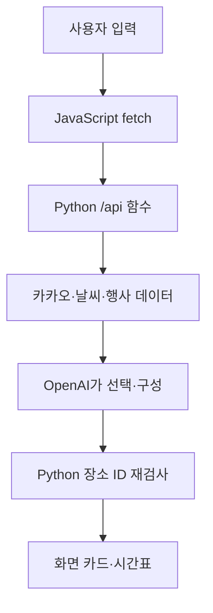

# 오늘 어디로? - 동네 단위 AI 여행·지역생활 플래너

현재 위치 또는 법정동·행정동을 확인하고, 날짜·동행·이동수단·관심사를 입력하면 **실제로 검색된 장소만 사용해** 당일 여행을 만드는 반응형 웹서비스입니다.

> 배포 URL: `https://today-where-ai.vercel.app`  
> GitHub URL: `https://github.com/hahahoho12360/today-where-ai`  


## 핵심 기능

1. **지역 선택**: 전체 동 이름 직접 입력, 브라우저 현재 위치, 미선택 시 AI 전국 후보 2~3곳
2. **AI 맞춤 일정**: 검증된 카카오 장소 ID만 이용한 시간표
3. **생활 장소**: 음식점·카페·주차장 각 1곳과 개별/전체 재추천
4. **날씨·행사**: 날짜 범위 안의 날씨와, 키 등록 시 TourAPI 축제
5. **내 여행**: 최근 결과 5개 자동 저장, 복사, Markdown 다운로드, 인쇄

## 과제 요구사항 충족표

| 과제 조건 | 이 프로젝트의 구현 |
| --- | --- |
| 3개 이상 페이지/섹션 | 메뉴로 이동하는 5개 섹션 |
| 모바일 반응형 | 900px, 720px, 460px 미디어 쿼리 |
| AI 입력 → 결과 | 지역 후보 추천과 검증 장소 기반 여행 생성 |
| 바닐라 프론트엔드 | `index.html`, `css/styles.css`, `js/app.js` |
| Python 서버리스 | `api/`의 5개 파일 기반 Vercel Functions |
| 프론트/백엔드 분리 | 화면 파일과 `api/`, `lib/` 분리 |
| 실패 처리 | 빈 입력, 잘못된 지역·날짜, 4xx/5xx, 네트워크, 26초 타임아웃 |
| API 키 보안 | 서버 환경 변수만 사용, `.env`는 Git 제외 |
| 보너스 1 | localStorage 최근 여행 5개 자동 저장과 재호출 절약 후보 풀 |
| 보너스 2 | 다크 모드, 미세 상호작용, 로컬 사용·응답시간 측정 |

## 기술 스택과 역할

- **HTML**: 제목, 입력창, 버튼, 결과 카드 같은 뼈대
- **CSS**: 색·간격·레이아웃과 모바일 반응형 화면
- **JavaScript**: 입력 검사, 현재 위치 요청, `fetch()` 호출, 결과 렌더링, 로컬 저장
- **Python**: 비밀 키 보호, 외부 API 요청, AI 결과 검증, 오류 상태 코드 반환
- **Vercel**: 정적 프론트엔드와 `api/*.py` 서버리스 함수 배포



## 폴더 구조

```text
today-where-ai/
├── index.html
├── css/styles.css
├── js/app.js
├── api/
│   ├── current_region.py
│   ├── verify_region.py
│   ├── recommend_regions.py
│   ├── generate.py
│   └── health.py
├── lib/backend.py
├── tests/
├── docs/
├── requirements.txt
├── vercel.json
└── .env.example
```

## 환경 변수

| 이름 | 필수 | 용도 |
| --- | --- | --- |
| `OPENAI_API_KEY` | 필수 | AI 지역 후보와 여행 계획 생성 |
| `OPENAI_MODEL` | 필수 권장 | 기본값 `gpt-5.6-luna`; 계정에서 사용 가능한 모델로 변경 가능 |
| `KAKAO_REST_API_KEY` | 필수 | 주소·좌표·음식점·카페·주차장 확인 |
| `TOUR_API_KEY` | 선택 | 실제 지역 축제 표시 |

`.env.example`을 복사해 `.env`를 만들고 값만 채웁니다. **키는 코드, README, 스크린샷, 채팅, GitHub에 올리지 않습니다.** OpenAI 공식 문서는 API 키를 서버 환경 변수로 읽는 SDK 사용법을 안내합니다.

## 로컬 실행

Python 3.13와 Node.js가 설치된 터미널에서 실행합니다.

```bash
python -m venv .venv
```

Windows PowerShell:

```powershell
.venv\Scripts\Activate.ps1
pip install -r requirements.txt
Copy-Item .env.example .env
npm install -g vercel
vercel dev
```

macOS/Linux:

```bash
source .venv/bin/activate
pip install -r requirements.txt
cp .env.example .env
npm install -g vercel
vercel dev
```

브라우저에서 터미널에 표시된 주소(보통 `http://localhost:3000`)를 엽니다. 현재 위치는 브라우저 정책상 배포된 HTTPS 주소에서 최종 확인하는 것이 가장 안전합니다.

## 자동 테스트

```bash
python -m unittest discover -s tests -v
node --check js/app.js
```

실제 키가 필요한 통합 테스트는 배포 후 `TEST_CHECKLIST.md` 순서로 직접 확인합니다.

## GitHub와 Vercel 배포

1. 새 GitHub 저장소 `today-where-ai`를 만듭니다.
2. 이 폴더에서 `git init`, `git add .`, `git commit`을 실행하고 GitHub로 push합니다.
3. Vercel에서 **Add New → Project → GitHub 저장소 Import**를 선택합니다.
4. Framework Preset은 `Other`, Root Directory는 프로젝트 루트로 둡니다.
5. Vercel Project Settings → Environment Variables에 필수 키를 입력합니다.
6. Deploy 후 `/api/health`와 전체 사용자 흐름을 검사합니다.
7. README 첫 부분의 배포 URL과 GitHub URL을 실제 값으로 바꾸고 다시 push합니다.

상세한 클릭 순서와 증빙 방법은 [docs/STEP_BY_STEP_GUIDE.md](docs/STEP_BY_STEP_GUIDE.md)를 따르세요. 과제 문항별 대응은 [docs/REQUIREMENTS_MATRIX.md](docs/REQUIREMENTS_MATRIX.md), 현재 검증 범위는 [docs/TEST_REPORT.md](docs/TEST_REPORT.md)에 따로 적었습니다.

## API와 사실성 원칙

- 카카오 Local API: 주소와 좌표를 서로 바꾸고 카테고리 장소를 찾습니다.
- Open-Meteo: 15일 이내 날짜의 일별 예보를 가져옵니다.
- 한국관광공사 TourAPI: 키가 있을 때 날짜·시도 기준 축제를 가져옵니다.
- OpenAI Responses API Structured Outputs: 정해진 구조의 여행 계획을 만듭니다.
- AI가 반환한 장소 ID가 실제 카카오 후보에 없으면 서버가 버리고 검증 후보로 대체합니다.
- 영업시간, 평점, 메뉴, 가격, 실시간 주차 가능 여부는 만들지 않습니다.

공식 문서: [OpenAI Structured Outputs](https://developers.openai.com/api/docs/guides/structured-outputs), [카카오 Local API](https://developers.kakao.com/docs/ko/local/dev-guide), [Vercel Python Runtime](https://vercel.com/docs/functions/runtimes/python), [MDN Geolocation](https://developer.mozilla.org/en-US/docs/Web/API/Geolocation/getCurrentPosition)

## 비용·쿼터·오류 대응

- 첫 생성은 카카오 후보 검색과 AI 1회 호출을 사용합니다.
- 개별 장소 재추천은 저장된 후보를 순서대로 보여 줘 추가 API 비용이 없습니다.
- 전체 재추천만 AI를 다시 호출합니다.
- 429는 과도한 요청, 401/403은 키·권한, 5xx는 외부/서버 오류로 구분해 사용자 문장으로 안내합니다.
- 키 노출이 의심되면 즉시 폐기·재발급하고, Git 기록에 들어갔다면 기록에서도 제거합니다.

## 보너스 기능의 측정 방법

- **저장 고도화**: 계획 생성 뒤 최근 여행 수가 늘어나는지, 새로고침 뒤에도 남는지 확인합니다.
- **UX 고도화**: 라이트/다크 모드에서 글자 대비, 390px 모바일에서 가로 넘침, `prefers-reduced-motion`을 확인합니다.
- **효과 측정**: 내 여행의 로컬 지표에서 계획 수, 재추천 수, 최근 응답시간을 기록합니다. 이는 개인 브라우저 기준이며 전체 방문자 통계로 과장하지 않습니다.

## 제출 파일

- Vercel 배포 URL
- GitHub 저장소 URL
- 이 `README.md`
- `docs/SERVICE_PLAN.md`
- `evidence/`에 넣은 데스크톱·모바일·AI 작동·AI 코딩 과정 증빙

## 라이선스·주의

학습 과제용 프로젝트입니다. 외부 API의 이용약관과 출처 표시 정책을 확인하고, 방문 전 장소의 최신 정보를 지도와 업체에서 다시 확인하세요.
